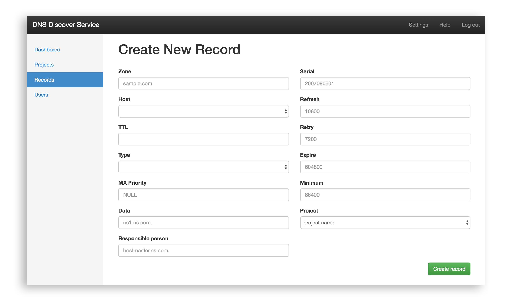

# DNS Discover Service

## Overview

DNS Discover Service is application for standard [DNS](https://en.wikipedia.org/wiki/Domain_Name_System) server called [BIND](https://en.wikipedia.org/wiki/BIND) enabling dynamically loadable [Zone files](https://en.wikipedia.org/wiki/Zone_file) with Project and User management on the top of that.

The app is written in Java, using [Spring Framework](http://spring.io/) on backend connected with PostgreSQL database. Following REST API fundamentals for easy extension the backend communicate on request/response base with frontend written in [Angular.js](https://angularjs.org/).



## Getting Started

These instructions will get you a copy of the project up and running on your local machine for development and testing purposes.

### Prerequisities

Things you need to install and run the app

* Java JDK 1.8 - [Installation instructions](https://docs.oracle.com/javase/8/docs/technotes/guides/install/install_overview.html)
* Your favourite Java IDE - [Try IntelliJ IDEA](https://www.jetbrains.com/idea/)

### First running

1. First head to `src/main/resources/application.properties`
2. Setup your connection with database

```
#
# [ Database Configuration Section ]
#
spring.datasource.driverClassName=org.postgresql.Driver
spring.datasource.url=jdbc:postgresql://localhost:5432/dns
spring.datasource.username=postgres
spring.datasource.password=
spring.jpa.database-platform=org.hibernate.dialect.PostgreSQLDialect

```

3. Hit run in your IDE
4. Head to `http://localhost:8888/[ENDPOINT]`

End with an example of getting some data out of the system or using it for a little demo

## User-Project Management

### Roles

* **Watcher** - Can view records related to project
* **Editor** - Can view, edit and delete records related to project
* **Manager** - Can view, edit and delete records related to project. Add and delete another users (watchers and editors) related to project. Create and delete projects.
* **Admin** - Can view, edit and delete all records in app. Add and delete another users (watchers, editors and managers) across whole app. Create and delete all projects.

## Short API documentation

The full documention will be created on Apiary.io

### End-points

#### Role
* GET List of Roles `roles/`
* GET Detail of a specific Role `roles/{roleId}`
* (POST Grant user access to project)
* (POST Revoke user access to project)

#### DNS Record

* GET List of DNS Records `dnsrecords/`
* GET Detail of DNS Record with assigned Project `dnsrecords/{dnsRecordId}`
* POST Create a new DNS Record `dnsrecords/`
* PUT Edit existing DNS Record `dnsrecords/{dnsRecordId}`
* DELETE Delete selected DNS Record `dnsrecords/{dnsRecordId}`

#### Project

* GET List of Projects `projects/`
* GET Detail of Project with its DNS Records `projects/{projectId}`
* POST Create a new Project `projects/`
* PUT Edit existing Project `projects/{projectId}`
* DELETE Delete selected Project `projects/{projectId}`

#### User

* GET List of users `users/`
* GET Detail of user `users/{userId}`
* POST Create a new user `users/`
* PUT Edit existing user `users/{userId}`
* DELETE Delete existing user `users/{userId}`

#### Auth

* POST Login user
* GET Logout
* (POST password/reset, POST password/email, GET password/reset/{token}, GET password/reseted) - not finished yet

## Built With

* Spring Framework
* PostgreSQL
* Maven
* Bootstrap
* Tomcat
* Angular.js

## Team

* **Marek Dlugos** - *Database, API, Frontend App* - [Marek's web site](http://mareks.space)
* **Jakub Lecbych** - *Tests, Frontend App* - [Jakub's e-mail](mailto:lecbyjak@fel.cvut.cz)

Project was developed in cooperation with [TeskaLabs](https://www.teskalabs.com/).

## License

This project is licensed under the Apache License - see the [LICENSE.md](LICENSE.md) file for details.

## Acknowledgments

### Inspiration

* [Bind DLZ PostgreSQL example](http://bind-dlz.sourceforge.net/postgresql_example.html)
* [Bind with DLZ, MySQL and replication](http://gentoo-en.vfose.ru/wiki/Bind_with_DLZ,_MySQL_and_replication)
